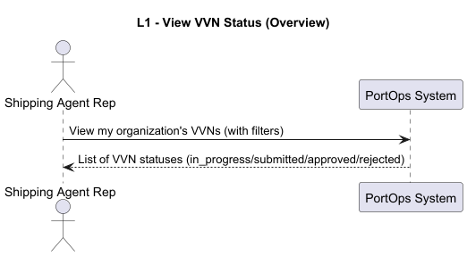
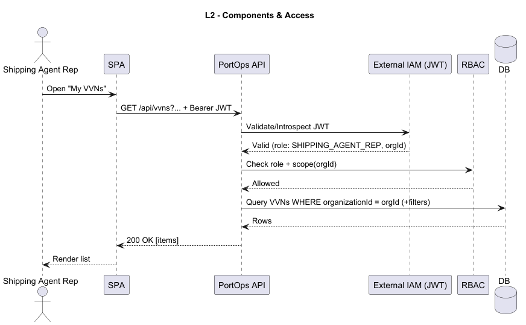
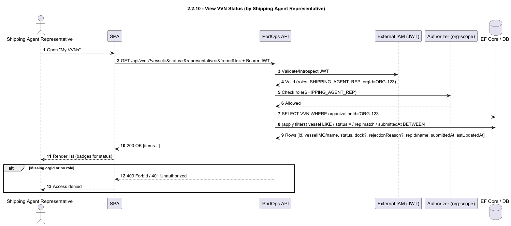

## User Story 2.2.10. View Vessel Visit Notifications Status

### 2.2.10. As a Shipping Agent Representative, I want to view the status of all my submitted Vessel Visit Notifications (in progress, pending, approved with current dock assignment, or rejected with reason), so that I am always informed about the decisions of the Port Authority.
**Acceptance Criteria / Comments:**
 - The Shipping Agent Representative may also view the status of Vessel Visit Notifications submitted by other representatives working for the same shipping agent organization.
 - Vessel Visit Notifications must be searchable and filterable by vessel, status, representative and time.

### SD Level 1

### SD Level 2

### SD Level 3

