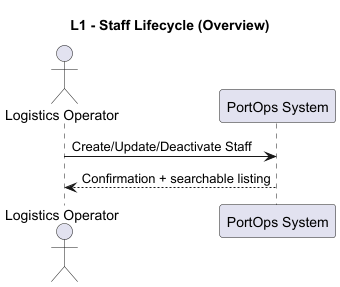
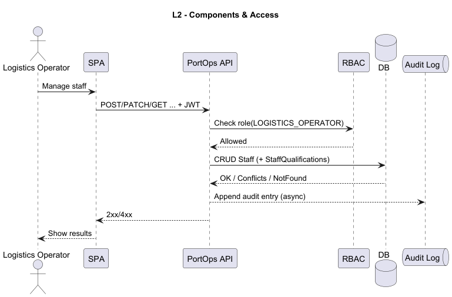
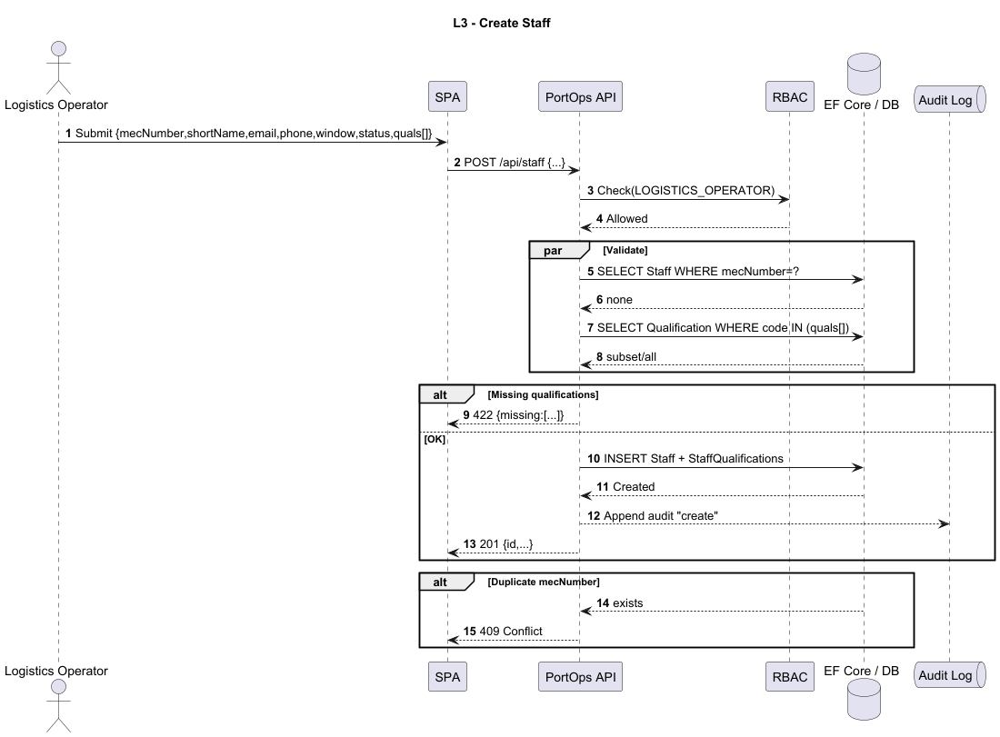
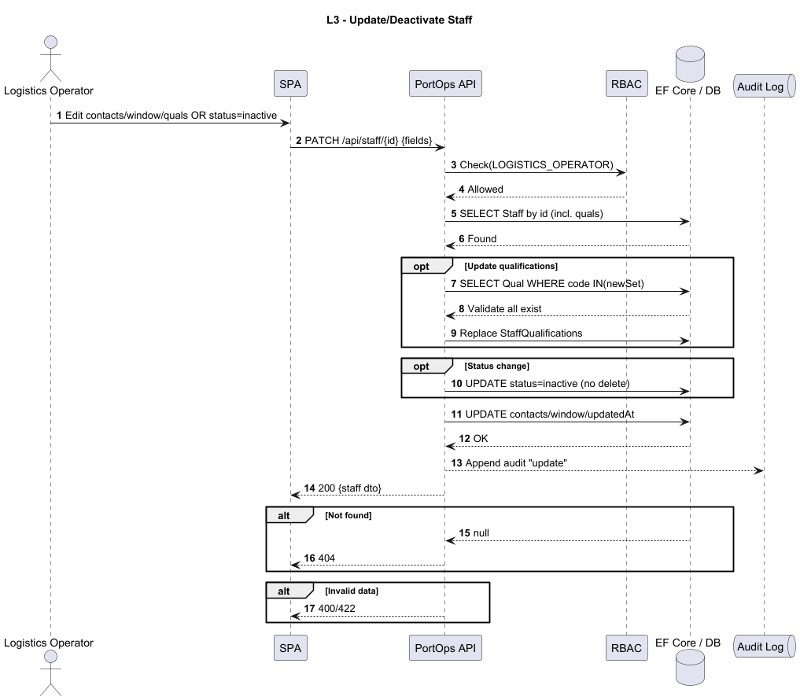
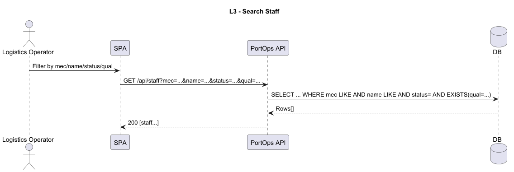

## User Story 2.2.11. Create/Update Staff Member

### 2.2.11. As a Logistics Operator, I want to register and manage operating staff members (create, update, deactivate), so that the system can accurately reflect staff availability and ensure that only qualified personnel are assigned to resources during scheduling.
**Acceptance Criteria / Comments:**
 - Each staff member must have a unique mecanographic number (ID), short name, contact details (email, phone), qualifications, operational window, and current status (e.g., available, unavailable).
 - Deactivation/reactivation must not delete staff data but preserve it for audit and historical planning purposes.
 - Staff members must be searchable and filterable by id, name, status, and qualifications.

### SD Level 1

### SD Level 2

### SD Level 3
SD CREATE

SD UPDATE

SD SEARCH

