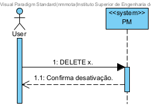

## User Story 2.2.12. Create/Update Physical Resource

### 2.2.12. As a Logistics Operator, I want to register and manage physical resources (create, update, deactivate), so that they can be accurately considered during planning and scheduling operations.
**Acceptance Criteria / Comments:**
 - Resources include cranes (fixed and mobile), trucks, and other equipment directly involved in vessel and yard operations.
 - Each resource must have a unique alpha-numeric code and a description.
 - Each resource must store its operational capacity, which varies according to the kind of resource, and, if any, the assigned area (e.g., Dock A, Yard B).
 - Additional properties must include:
 - Current availability status (active, inactive, under maintenance).
 - Setup time (in minutes), if relevant, before starting operations.
 - (Staff) Qualification requirements, ensuring only properly certified staff can be scheduled with the resource.
 - Deactivation/reactivation must not delete resource data but preserve it for audit and historical planning purposes.
 - Resources must be searchable and filterable by code, description, kind of resource, status.

### SD Level 1

User: Logistics Operator 
x: Physical Resource

### SD Level 2

N/A

### SD Level 3

N/A