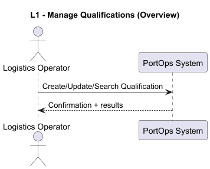
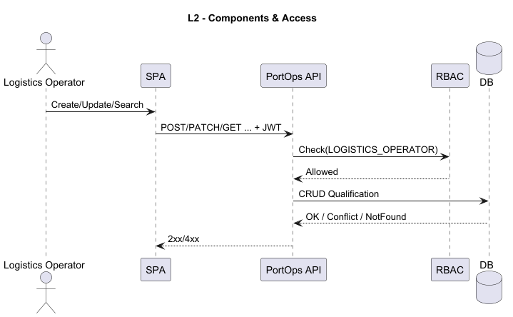
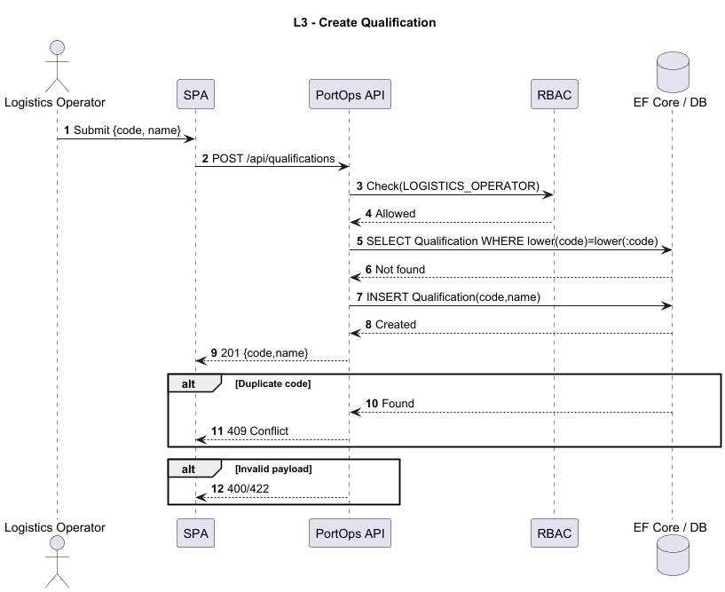
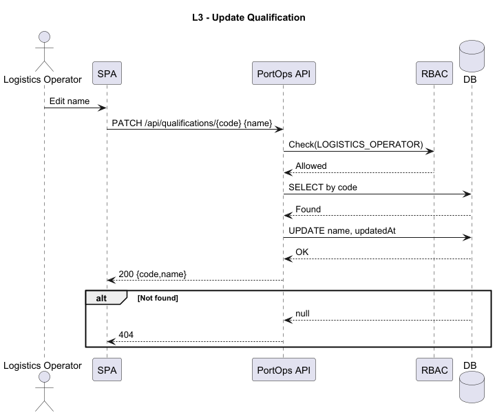
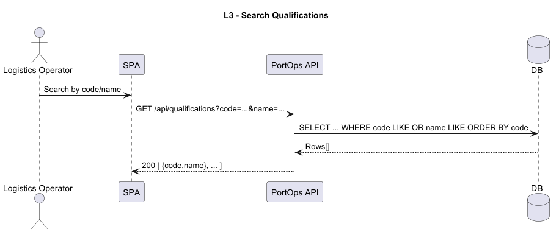

## User Story 2.2.13. Create/Update Qualification

### 2.2.13. As a Logistics Operator, I want to register and manage qualifications (create, update), so that staff members and resources can be consistently associated with the correct skills and certifications required for port operations.
**Acceptance Criteria / Comments:**
 - Each qualification has a unique code and a descriptive name (e.g., "STS Crane Operator", "Truck Driver").
 - Qualifications must be searchable and filterable by code or name.
 - A qualification must exist before it can be assigned to staff members or resources.

### SD Level 1

### SD Level 2

### SD Level 3

SD CREATE

SD UPDATE

SD SEARCH

