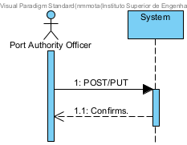

## User Story 2.2.2. Create/Update Vessel

### 2.2.2. As a Port Authority Officer, I want to register and update vessel records, so that valid vessels can be referenced in visit notifications.
**Acceptance Criteria / Comments:**
 - Each vessel record must include key attributes such as IMO number, vessel name, vessel type and operator/owner.
 - The system must validate that the IMO number follows the official format (seven digits with a check digit), otherwise reject it.
 - Vessel records must be searchable by IMO number, name, or operator.

### SD Level 1

### SD Level 2

N/A

### SD Level 3

N/A