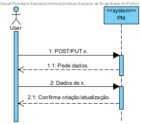
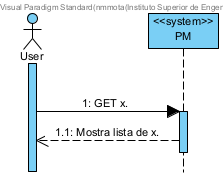

## User Story 2.2.3. Create/Update Dock

### 2.2.3. As a Port Authority Officer, I want to register and update docks, so that the system accurately reflects the docking capacity of the port.
**Acceptance Criteria / Comments:**
 - A dock record must include a unique identifier, name/number, location within the port, and physical characteristics (e.g., length, depth, max draft).
 - The officer must specify the vessel types allowed to berth there.
 - Docks must be searchable and filterable by name, vessel type, and location.

### SD Level 1

User: Port Authority Officer 
x: Dock

### SD Other Levels

N/A