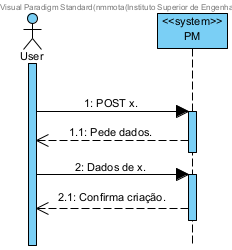

## User Story 2.2.8. Create Vessel Visit Notification

### 2.2.8. As a Shipping Agent Representative, I want to create/submit a Vessel Visit Notification, so that the vessel berthing and subsequent (un)loading operations at the port are scheduled and planned in space and timely manner.
**Acceptance Criteria / Comments:**
 - The Cargo Manifest data for unloading and/or loading is included.
 - The system must validate that referred containers identifiers comply with the ISO 6346:2022 standard.
 - Information about the crew (name, citizen id, nationality) might be requested, when necessary, for compliance with security protocols.
 - Vessel Visit Notifications might become at an "in progress" status (e.g. cargo information is incomplete) to be further update/completed.
 - When completed / ready for asking approval, the agent is required to change its state to "submitted".

### SD Level 1

User: Shipping Agent Representative 
x: Vessel Visit Notification

### SD Level 2

N/A

### SD Level 3

N/A