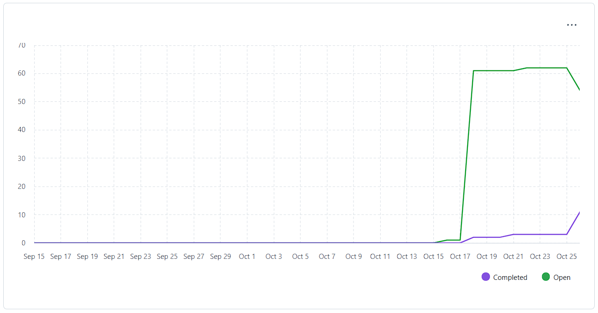
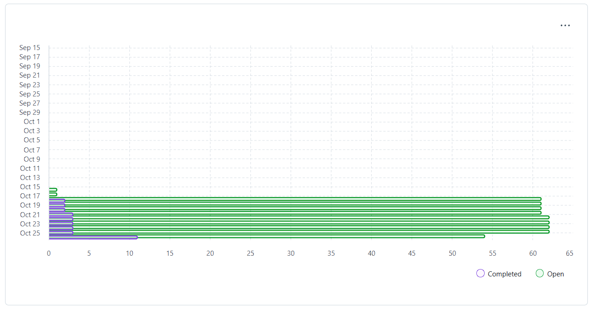

## Sprint Goal

 - Complete the 13 User Stories.

**Teamwork toward it:** We separated the User Stories into tasks and assigned them to the members of the team. 
**Changes in scope:** The only change we made was change member 1 and member 2 in the Mandatory Scope of Work in the Sprint Planning, for a better workflow, since member 1 started by US 2.2.1., thinking it was assigned to them since they were the member 1, but that US was assigned to member 2, so the members just switched. 
**Unexpected challenges:** Lack of time.

## Completed Work

 - User stories functional, but lacking refinement.

## Metrics and Progress

### Burndown

### Velocity
