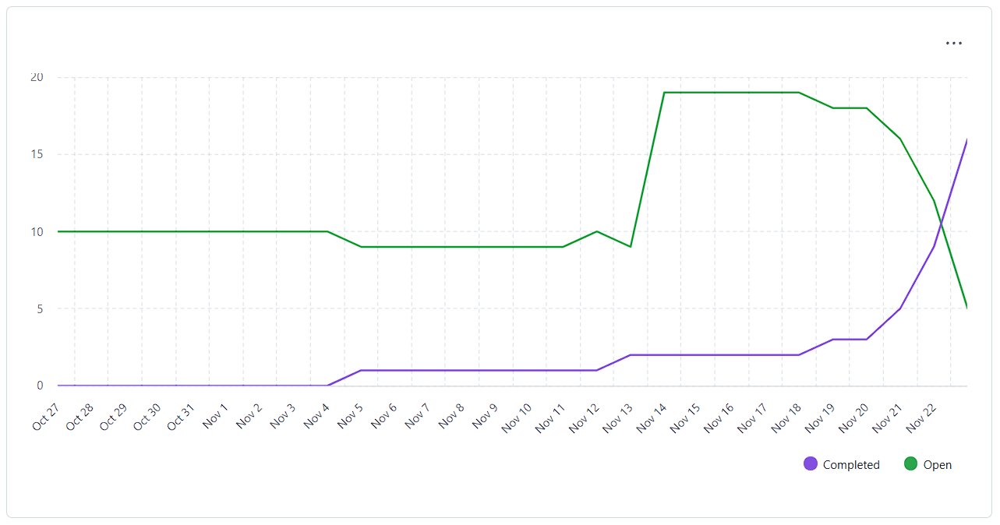
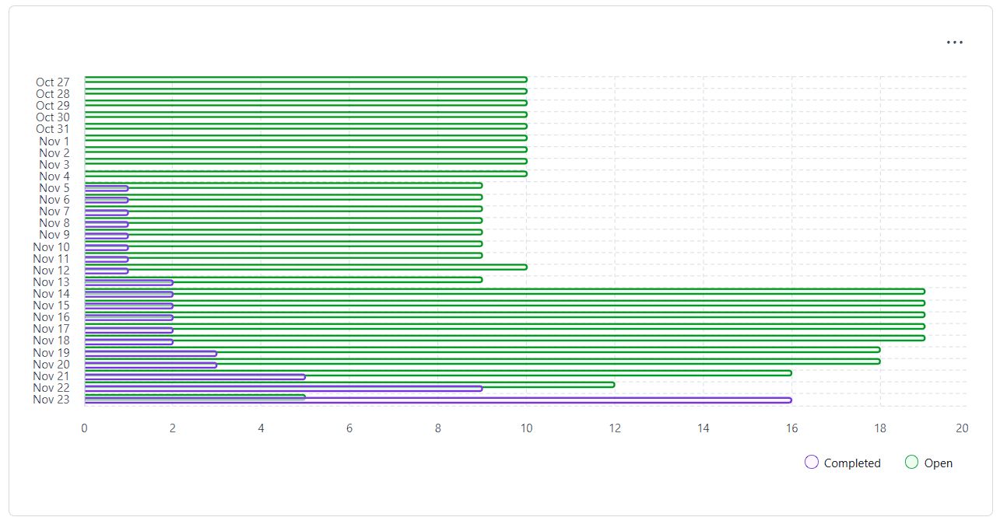

## Sprint Goal

- Complete the 5 (ARQSI) Front-end Application User Stories.
- Complete the 6 (SGRAI) 3D Visualization User Stories.
- Complete the 5 (IARTI) Scheduling & Planning User Stories.
- Complete the 2 (LAPR5) GDPR Awareness & Data Impact Understanding User Stories.

**Teamwork toward it:** We separated the Front-end Application and 3D Visualization User Stories for each member by the User Stories done in Sprint A. 
**Changes in scope:** Our initial scope was to do those 18 User Stories in the Sprint Goal, but we also considered broading the scope to include the 6 Authentication & Authorization User Stories, if we had time. In the end, we didn't. What did change our scope was the fact that one of our team members disappeared during this Sprint, and he was the only one with IARTI, so the 5 Scheduling & Planning User Stories, the components in the Front-end Application assigned to him and the 3.3.3 User Story 3D Visualization were abandoned. 
**Unexpected challenges:** Lack of time and the absence of a team member.

## Completed Work

- To the exception of the GDPR Awareness & Data Impact Understanding User Stories, other User stories within our scope are functional, but lacking refinement.

## Metrics and Progress

### Burndown

### Velocity

