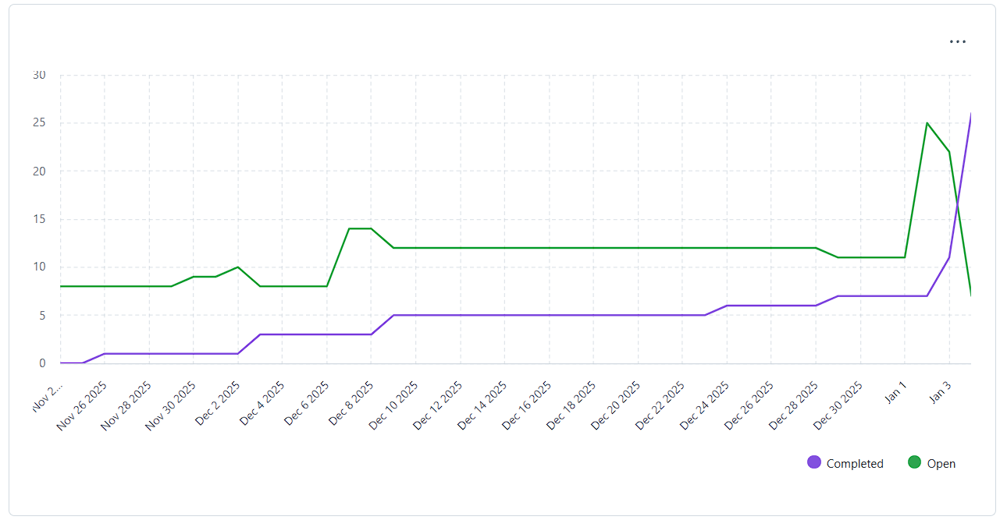
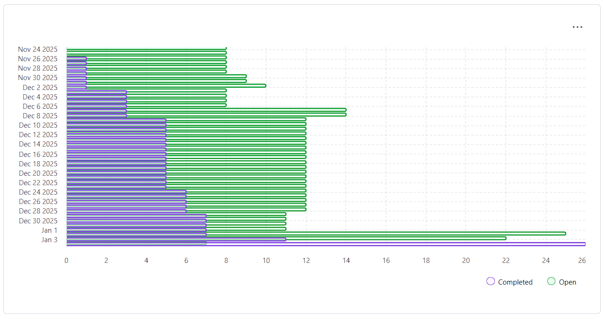

## Sprint Goal

- Complete the 10 assigned ARQSI User Stories.
- Complete the 5 assinged SGRAI User Stories.
- Complete the 4 assigned LAPR5 User Stories.
- Since last Sprint a team member left, there were some User Stories that were not completed. From thoses Sprint B User Stories, the ones that need to be done for the Sprint C User Stories to work correctly, they will be divided to the remaining team members to complete.

**Teamwork toward it:** We separated the work between the three team members, having into account what each has done in Sprints A and B, and the classes everyone has. The work that should have been done by the team member that left was divided between the remaining three. 
**Changes in scope:** Our scope did not change throughout the Sprint. 
**Unexpected challenges:** Lack of time and having to do addicional work to cover the work that the team member that left did not do in the last Sprint.

## Completed Work

- SGRAI and LAPR5 User Stories were completed. A few ARQSI User Stories still needed to be enhanced to be considerer completed.

## Metrics and Progress

### Burndown

### Velocity

